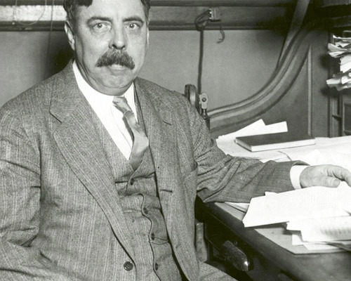

::: {.quote-container}
{.author-photo}
::: {.quote-text}
> "*Whatever exists at all, exists in some amount. Anything that exists in amount can be measured.*"
>
> — E. L. Thorndike

:::
:::

## Welcome
Welcome to my measurement tools page. Here you'll find psychometric instruments I've developed or adapted. Click on any tool below to jump to its details. 
---

## Available Tools

::: {.grid}

::: {.g-col-12 .g-col-md-6 .g-col-lg-4}
::: {.card}
### [Work Volition Scale](#tool1)
Measures perceived capacity to make occupational choices
:::
:::

::: {.g-col-12 .g-col-md-6 .g-col-lg-4}
::: {.card}
### [Burnout Inventory](#tool2)
Assesses emotional exhaustion and depersonalization
:::
:::

::: {.g-col-12 .g-col-md-6 .g-col-lg-4}
::: {.card}
### [Career Satisfaction Scale](#tool3)
Evaluates satisfaction with career development
:::
:::

:::

---

## Burnout Inventory {#tool2}

**Description:** Comprehensive assessment of burnout dimensions.

- **Purpose:** Measure occupational burnout
- **Population:** School counselors, helping professionals
- **Items:** 22 items
- **Language(s):** English, Turkish
- **Citation:** Your Name et al. (2025).

[Download PDF](#) | [View Scale Items](#) | [Request Permission](mailto:your@email.com)

---

## Career Satisfaction Scale {#tool3}

**Description:** Brief description here.

- **Purpose:** ...
- **Population:** ...
- **Items:** ...

[Download PDF](#) | [Request Permission](mailto:your@email.com)

